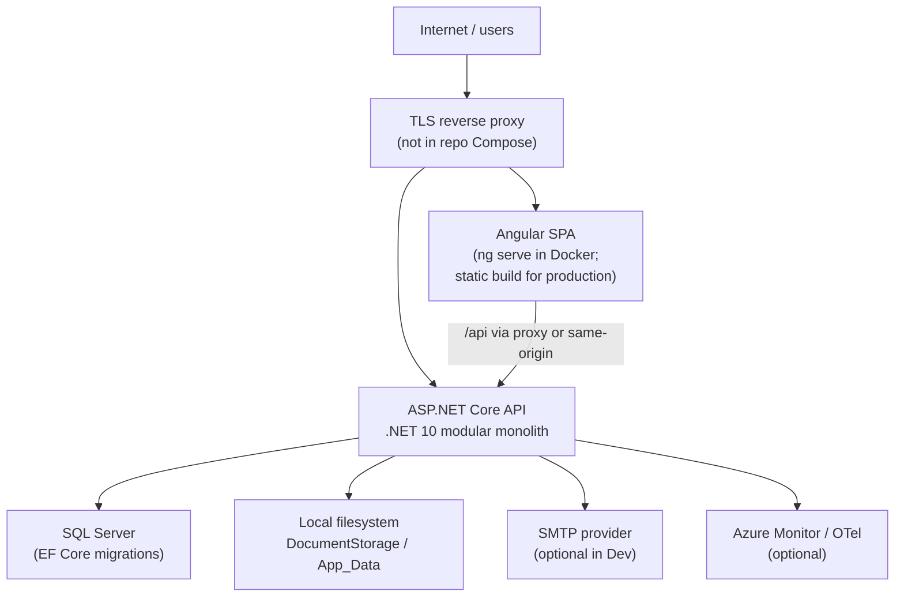

# Cloud Hosting Readiness Audit

**Audit date:** 2026-09-21  
**Repository:** CarehomeSystem (Care Home Back-Office / Revenue Cycle)  
**Branch:** `revenue-cycle-v2`  
**Commit:** `e8b7c53e0cd4bc53ad15aa7ba5b89b7200ce9604`  
**Working tree at audit start:** Clean tracked sources (untracked `bin/`/`obj/` build artifacts present).  
**Version line:** **Enhanced / V2** (`revenue-cycle-v2`) — modular monolith with payments, bank reconciliation, remittance, and revenue assurance. **`main`** is the prior baseline (~12 migrations under `CareHome.Api/Migrations`); this branch moves migrations to `CareHome.Data` and adds four revenue-cycle migrations.

---

## Executive answer

| Question | Answer |
|----------|--------|
| **Can this exact repo be deployed to a cloud server using Docker today?** | **Yes for production path after configuration.** API `Dockerfile` copies full `backend/`; use `Dockerfile.prod` + `docker-compose.prod.yml` for OCI/public VM hosting. Dev `docker-compose.yml` remains local/demo only. |
| **Can it be hosted in public cloud at all?** | **Yes, after required fixes** — primarily Docker/publish pipeline, Production configuration, TLS/reverse proxy, isolated database, persistent document volume, SMTP (or explicit simulation waiver), and network hardening. Non-Docker paths (`scripts/Publish-CareHome.ps1`, Azure Bicep) are documented and align better with production. |

### Classifications

| Dimension | Classification |
|-----------|----------------|
| **Cloud hostability** | **HOSTABLE AFTER REQUIRED FIXES** |
| **Public demo readiness** | **CONDITIONAL** (isolated VM, dev-oriented Compose, no public SQL, accept simulated email) |
| **Real customer production readiness** | **CONDITIONAL** (needs Production secrets, SMTP or signed-off simulation, backups, document storage, migration discipline, TLS) |

---

## 1. Application identity

| Field | Value |
|-------|--------|
| Application name | Care Home Back-Office Management System (CarehomeSystem) |
| Branch | `revenue-cycle-v2` |
| Commit SHA | `e8b7c53` |
| Recent commits | Revenue cycle expansion, pagination/identifiers, UI workspace UX, docs/QA |
| Basic vs Enhanced | **Enhanced V2** on `revenue-cycle-v2`; **Basic/V1** ≈ `main` (no `CareHome.Data` migration set; fewer schema features) |

---

## 2. Architecture (as implemented)



### Components

| Layer | Technology | Notes |
|-------|------------|--------|
| Frontend | Angular 22 (`frontend/care-home-web`) | Relative `/api` URLs; dev proxy `proxy.conf.json` / `proxy.conf.docker.json` |
| Backend | ASP.NET Core Web API (.NET 10) | Single process; domain modules as libraries |
| Database | SQL Server | EF Core; migrations in `backend/CareHome.Data/Migrations` |
| Cache | **None** | No Redis |
| Object storage | **Local disk only** | `LocalDocumentStore` → `DocumentStorage:RootPath` or `App_Data/documents` |
| Email | SMTP or simulated | `ConfigurableEmailSender`; Production startup validator enforces SMTP or explicit simulation flag |
| Background jobs | **None** | No Hangfire/Quartz/hosted workers |
| AI / external APIs | **None** in code | |
| Reverse proxy | **Not in repository** | Documented expectation: IIS, nginx, App Gateway, Cloudflare, etc. |
| Authentication | Identity + JWT | Login passwords RSA-encrypted in Production (per-instance key) |
| Monitoring | OpenTelemetry + optional Azure Monitor | `APPLICATIONINSIGHTS_CONNECTION_STRING` |
| Build | `dotnet` + `npm`; `scripts/Publish-CareHome.ps1` | SPA copied into API `wwwroot` for same-origin production |
| Docker | `docker-compose.yml`, API/frontend Dockerfiles | **Dev/demo oriented** |

### Independently running processes (typical Compose)

1. `mcr.microsoft.com/mssql/server:2022-latest` (sql)  
2. `carehome-api` (ASP.NET)  
3. `carehome-web` (Node `ng serve`)

---

## 3. Docker readiness

### Files

| File | Role |
|------|------|
| `docker-compose.yml` | SQL + API + web (default) |
| `docker-compose.dev.yml` | Bind mounts, `dotnet watch`, dev overrides |
| `backend/CareHome.Api/Dockerfile` | Production-style API image (publish) |
| `backend/CareHome.Api/Dockerfile.dev` | SDK + watch (API only; same copy gap) |
| `frontend/care-home-web/Dockerfile` | Node 22 + **`ng serve`** (not production static) |
| `.dockerignore` | Excludes `docs`, `scripts`, tests, `.env`, `App_Data` |

### Build context

- Compose build `context: .` (repo root) — correct for multi-project backend **if** Dockerfile copies all referenced projects.

### Critical API Dockerfile defect (P0)

`backend/CareHome.Api/Dockerfile` only copies:

```dockerfile
COPY backend/CareHome.Api/CareHome.Api.csproj backend/CareHome.Api/
COPY backend/CareHome.Api/ backend/CareHome.Api/
```

`CareHome.Api.csproj` references `CareHome.Data`, `CareHome.Billing`, `CareHome.Funding`, `CareHome.Receivables`, `CareHome.Payments`, `CareHome.Reconciliation`, `CareHome.Remittance`, `CareHome.RevenueAssurance`, and `CareHome.Abstractions`. Those paths are **not** copied into the image. **`dotnet restore` / `dotnet publish` inside the container will fail.**

`scripts/Publish-CareHome.ps1` publishes from the full repo on the host and **does** work (validated via `dotnet build`).

### Compose behaviour

| Check | Status |
|-------|--------|
| `docker compose build` | **Blocked** on audit host (Docker daemon not running); **expected API image failure** due to Dockerfile scope |
| Exposed ports | `14333→sql`, `5092→api`, `4200→web` |
| API start | `dotnet CareHome.Api.dll`, port 8080 internal |
| Health checks | API: `/health/live` (image), `/health/ready` (compose); SQL: `sqlcmd` |
| Production profile | **None** — `ASPNETCORE_ENVIRONMENT=Development` |
| Env vars | Dev JWT placeholder allowed; `Database__ApplyMigrations=true` |
| Volumes | `carehome-sql-data`, `carehome-documents` |
| Non-root | **No** — default root in .NET/Node/SQL images |
| Restart | `on-failure` on API only |

### Frontend image

- Runs **`npx ng serve`** with Docker proxy — suitable for **local/demo**, not for internet-facing production (no static build, no CDN caching, dev server overhead).

---

## 4. Multi-architecture (AMD64 / ARM64)

| Image | AMD64 | ARM64 | Notes |
|-------|-------|-------|--------|
| `mcr.microsoft.com/dotnet/aspnet:10.0` | Yes | Yes | API runtime |
| `mcr.microsoft.com/dotnet/sdk:10.0` | Yes | Yes | Build stage |
| `node:22.22-bookworm-slim` | Yes | Yes | Frontend |
| `mcr.microsoft.com/mssql/server:2022-latest` | Yes | **Poor / impractical** | Official SQL Server Linux container is **amd64-centric**; Oracle Cloud **ARM** VMs typically need **external SQL** (Azure SQL, managed SQL on amd64 VM, etc.) |

**Oracle Cloud ARM:** API + static frontend containers likely **ARM64-compatible**; **do not rely on SQL Server in Docker on ARM** for this stack.

---

## 5. Database readiness

| Item | Detail |
|------|--------|
| Engine | SQL Server |
| ORM / migrations | EF Core; migrations in **`backend/CareHome.Data/Migrations`** |
| Migration head | **`20260921163828_CommercialRevenueCycleExtensions`** |
| Chain length | 16 migrations (listed via `dotnet ef migrations list --project backend/CareHome.Data --startup-project backend/CareHome.Api --no-connect`) |
| Empty database | Supported via `MigrateAsync()` when `Database__ApplyMigrations=true` (Compose) or manual `dotnet ef database update` |
| Upgrade existing | Standard EF `database update` after backup |
| Manual SQL | No undocumented manual scripts identified in migration `.cs` files reviewed |
| Startup destroy/recreate | **No** `EnsureCreated` in `Program.cs`; migrations only when flag set |
| Production default | `Database__ApplyMigrations` defaults **false** (correct for production) |
| README drift | `README.md` still points migrations at `CareHome.Api` only — use `--project CareHome.Data` |

### Basic vs Enhanced database isolation (mandatory)

| Branch | Migration location | Latest head (approx.) |
|--------|-------------------|------------------------|
| `main` | `CareHome.Api/Migrations` (12 migrations) | `20260911053954_UniqueMiscChargeDedupeIndex` |
| `revenue-cycle-v2` | `CareHome.Data/Migrations` (16 migrations) | `20260921163828_CommercialRevenueCycleExtensions` |

**Rule: THIS VERSION (`revenue-cycle-v2`) MUST USE ITS OWN DATABASE.** Never point Basic (`main`) and Enhanced (V2) deployments at the same SQL database. Schema history and migration assemblies differ; sharing a DB risks failed migrations, partial schema, or mixed EF history.

---

## 6. Persistent file storage

| Data | Location | Survives restart? | Customer data? |
|------|----------|-------------------|----------------|
| Invoice / credit-note PDFs | `DocumentStorage:RootPath` | **Only with volume/mount** | Yes |
| Sage export CSVs | Same store | Volume required | Yes |
| Uploaded misc charges / remittance / bank files | Processed in memory + DB; exports on disk | Partial | Yes |
| Temp | Minimal explicit temp usage | N/A | |

**Implementation:** `IDocumentStore` → `LocalDocumentStore` only. **No S3/Azure Blob adapter** in code.

**Compose:** `carehome-documents` volume mounted at `/app/App_Data/documents` — **correct pattern for single-node Docker**.

**Gap:** Cloud object storage requires new provider or mounted Azure Files/NFS (Bicep documents share is the Azure path).

---

## 7. Environment variables (production)

Do **not** commit values. See `docs/PRODUCTION_CONFIGURATION.md`.

### Required in Production

| Variable | Purpose |
|----------|---------|
| `ASPNETCORE_ENVIRONMENT` | Must be `Production` |
| `ConnectionStrings__DefaultConnection` | SQL Server (not LocalDB) |
| `Jwt__Key` | ≥32 char signing secret (not dev placeholder) |
| `Email__Mode` | `Smtp` **or** waiver via `Email__AllowSimulationInProduction=true` |
| `Email__Smtp__Host`, `Email__FromAddress` | If SMTP mode |
| `Email__Smtp__Password` | If SMTP auth |
| `Cors__AllowedOrigins__*` | If SPA on different origin; empty OK for same-origin `wwwroot` |

### Recommended

| Variable | Purpose |
|----------|---------|
| `DocumentStorage__RootPath` | Dedicated volume path |
| `ForwardedHeaders__KnownProxies__*` | When behind reverse proxy/LB |
| `APPLICATIONINSIGHTS_CONNECTION_STRING` | Azure Monitor |
| `Seed__AdminEmail` / `Seed__AdminPassword` | One-time bootstrap only; remove after |

### Optional

| Variable | Purpose |
|----------|---------|
| `Database__ApplyMigrations` | **Should stay false** in production |
| `Telemetry__EnableConsoleExporter` | Debug |
| `Https__Redirect` | Default true in Production |
| `App__PublicUrl` | Links in emails/UI |

### Dangerous development defaults (must not reach public cloud)

| Location | Risk |
|----------|------|
| `docker-compose.yml` | `ASPNETCORE_ENVIRONMENT=Development`, default SA password `CareHomeDevSql2022@`, `Database__ApplyMigrations=true`, SQL port published |
| `appsettings.Development.json` | JWT placeholder, `admin@localhost` / `DevAdmin!12345` |
| `appsettings.json` | LocalDB connection string fallback for local dev |
| `.env.example` | Documents default SQL password |
| Compose `App__PublicUrl` | `http://localhost:4200` |

---

## 8. Secret safety

| Finding | Severity |
|---------|----------|
| No committed live API keys / private keys found in source scan | Good |
| Dev credentials documented in `README.md`, demo docs | Expected; **operational risk if exposed on screen** |
| `appsettings.Development.json` contains dev JWT key and seed password | Git-tracked **dev-only** file; not loaded when `ASPNETCORE_ENVIRONMENT=Production` |
| `.gitignore` | Ignores `.env`, `.env.demo`, `**/App_Data/`, `infra/azure/*.json`, `*.secrets.json` |

**Possible secret locations (templates only):** `appsettings.Production.json` (empty placeholders), `.env.example`, demo docs.

---

## 9. Frontend production readiness

| Item | Result |
|------|--------|
| Framework | Angular 22 |
| Production build | `npm run build` (default configuration: production) |
| Output | `frontend/care-home-web/dist/care-home-web/browser` |
| API URL | Relative `/api` — works same-origin or behind proxy |
| `npm ci` | **FAILED** — `package-lock.json` out of sync (`Missing: listr2@10.2.1`) |
| `npm install` + `npm run build` | **SUCCEEDED** (warnings: bundle budget exceeded ~1.23 MB initial) |
| CORS | Backend-driven; empty origins = deny cross-origin (same-origin OK) |
| SPA fallback | API `MapFallbackToFile("index.html")` when `wwwroot` exists |

**Docker frontend:** not production-ready (dev server).

---

## 10. Backend build & tests

| Step | Result |
|------|--------|
| `dotnet restore` / `dotnet build -c Release` | **SUCCESS** (EF obsolete warnings, NU1902 OpenTelemetry advisory) |
| `dotnet test -c Release --no-build` | **52 passed**, **26 skipped** (SQL integration — `CAREHOME_TEST_SQL` / LocalDB not available) |

---

## 11. Application startup (audit)

| Attempt | Result |
|---------|--------|
| Production-like Docker startup | Not run (no Docker daemon) |
| Production env without secrets | Would **fail** `ProductionStartupValidator` (connection string, email) — by design |

Development Compose (when Docker works and API image is fixed) would: start SQL → migrate if flag set → seed platform admin from Development settings → seed demo tenant data.

---

## 12. Health checks

| Endpoint | Liveness | Readiness | Anonymous |
|----------|----------|-----------|-----------|
| `/health/live` | Self | — | Yes |
| `/health/ready` | — | SQL (`SqlReadyHealthCheck`) | Yes |

No Redis/storage health checks (N/A). Suitable for load balancer **if** readiness is used for traffic (not only liveness).

---

## 13. Redis / cache

**Not used.** No multi-instance cache coherence concerns. Rate limiting is **in-memory per instance** (`FixedWindowLimiter` on login).

---

## 14. Email

| Mode | Behaviour |
|------|-----------|
| Development | Simulated send returns `Success=true`, `Simulated=true` |
| Production + SMTP | Real send; failures return `Success=false` |
| Production without SMTP | **Startup fails** unless `Email__AllowSimulationInProduction=true` |
| False success on SMTP failure | **No** — exceptions logged; `Success=false` |

---

## 15. Background processing

No schedulers or outbox workers. **Safe for single instance.** Multiple API instances: no duplicate job risk; login RSA key is **per process** (see security).

---

## 16. Reverse proxy & HTTPS

| Item | Status |
|------|--------|
| In-repo proxy | **None** |
| Cloud need | Terminate TLS at proxy/LB; expose **443** (and 80 redirect) only |
| Do not expose publicly | SQL `1433`, API `8080` except via proxy, Redis N/A |
| Forwarded headers | Enabled (`X-Forwarded-For`, `X-Forwarded-Proto`); Production trusts loopback + `ForwardedHeaders:KnownProxies` |
| HTTPS redirect / HSTS | On in Production when `Https:Redirect` true |

---

## 17. CORS

- Config: `Cors:AllowedOrigins` (env `Cors__AllowedOrigins__0`, …).
- Production: rejects `*` and localhost origins.
- Split SPA: set HTTPS frontend origin without rebuild.
- Docker dev: localhost origins when `Development`.

---

## 18. Database backups

| Environment | Strategy |
|-------------|----------|
| Documented | `scripts/Backup-CareHome.ps1`, `docs/BACKUP_RESTORE.md`, Azure Bicep PITR |
| Docker-only single VM | **Manual** — SQL backup + volume snapshot/`robocopy` of document root |
| Automation in Compose | **None** |

**Production readiness requires a documented backup + restore test** — scripts exist; not wired into default Compose.

---

## 19. Observability

- Structured logging via ASP.NET Core; correlation ID middleware.
- OpenTelemetry traces/metrics; Azure Monitor when connection string set.
- EF SQL text not logged in traces (`SetDbStatementForText = false`).
- Email sanitization for logs.

---

## 20. Resource requirements (estimate)

| Component | Minimum RAM (practical) |
|-----------|-------------------------|
| SQL Server container | **~2 GB** alone |
| API (.NET) | 512 MB–1 GB |
| Angular dev server | 512 MB–1 GB |
| Angular static | Negligible (served by API or CDN) |
| OS + proxy | 512 MB |

| VM size | Suitability |
|---------|-------------|
| **1 GB** | **Not suitable** (SQL alone exceeds) |
| **2 GB** | Tight demo only (SQL + API; prefer external DB) |
| **4 GB** | Minimum realistic **all-in-one Docker demo** |
| **8 GB+** | Comfortable demo/small pilot |

---

## 21. Free hosting compatibility

| Option | Verdict |
|--------|---------|
| Single free VM + Docker Compose | **Possible after fixes** — use **4 GB+**, firewall SQL port, dev Compose **not** internet-safe as-is |
| Oracle Cloud ARM | API/static **ARM64 OK**; **use external SQL**, not MSSQL container |
| x86 cloud VM | **AMD64 OK** for full Compose |
| Static frontend (Cloudflare Pages, etc.) | **Yes** — build Angular; set `Cors__AllowedOrigins` on API |
| External managed DB | **Yes** — required pattern for production and ARM |

---

## 22. Single-server Docker Compose

**Classification: SUPPORTED WITH CHANGES**

| Why | Detail |
|-----|--------|
| Supported | Compose file exists; health checks; document volume |
| Changes required | Fix API Dockerfile multi-project copy; production image with `wwwroot` SPA; `ASPNETCORE_ENVIRONMENT=Production` + secrets; remove public SQL port; add reverse proxy/TLS; do not use `ng serve` publicly |

---

## 23. Split cloud option

| Tier | Compatibility |
|------|----------------|
| Static frontend host | **Compatible** |
| Container / App Service API | **Compatible** (publish script + Bicep) |
| Managed SQL (Azure SQL, etc.) | **Recommended** |
| Managed Redis | N/A |
| Azure Files / blob for documents | **Mount or implement provider** |

---

## 24. Security review (internet exposure)

| Control | Status |
|---------|--------|
| JWT + Identity | Yes |
| Password policy | Strong (12+ chars) |
| Login rate limit | 10/min/IP (per instance) |
| Tenant middleware | `InactiveTenantMiddleware` |
| Authorization policies | Role-based + tenant scoping in services |
| Security headers | API middleware |
| CSRF | JWT API — typical SPA pattern |
| Dev endpoint | `/api/_dev/throw` **Development only** |
| Swagger | **Not enabled** |
| Default users | Dev seed only in Development |
| SQL/Redis public ports | **SQL exposed in Compose (P0 for public)** |
| File download | Authorized API; path traversal guarded in document store |
| Multi-instance login | **RSA key per API instance** — needs sticky sessions or shared key strategy for horizontal scale |

---

## 25. Recommended deployment architectures

### Option A — Free / demo (Docker on one VM)

```
Internet → Caddy/nginx (TLS) → Angular (static OR dev proxy) → API → SQL Server
                                      ↓
                              document volume
```

- **Resources:** 4 GB RAM minimum, 20+ GB disk.
- Use **private Docker network**; do **not** publish SQL.
- Accept simulated email or configure SMTP.
- **Dedicated database** for V2 only.

### Option B — Production

```
Internet → Azure App Service / container + TLS
              ├── wwwroot (Angular) + /api
              ├── Azure SQL
              ├── Azure Files (documents)
              └── Key Vault secrets + Application Insights
```

- Follow `docs/PRODUCTION_DEPLOYMENT.md`, `scripts/Publish-CareHome.ps1`, `infra/azure/main.bicep`.
- Migrations via `dotnet ef database update` **after backup**, not auto-migrate on startup.

---

## 26. Required fixes

### P0 — prevents cloud deployment (as-is)

1. **API Dockerfile missing backend project copies** — `docker build` for API cannot publish modular solution.
2. **Production configuration not satisfied by default Compose** — `ProductionStartupValidator` requires SQL connection, JWT, and SMTP (or explicit simulation waiver).
3. **Public SQL port + default SA password in Compose** — unsafe if VM has a public IP.
4. **Frontend Docker image uses `ng serve`** — not a production web server for public hosting.
5. **Database schema isolation** — V2 must not share DB with `main`/Basic deployments.

### P1 — before real customer data

1. Fix **`npm ci` / lockfile** sync for reproducible frontend builds (`Publish-CareHome.ps1` uses `npm ci`).
2. Production Docker/publish path: embed SPA in `wwwroot`, `ASPNETCORE_ENVIRONMENT=Production`, secrets from vault.
3. **Document volume** backup strategy on VM; or Azure Files with backup policy.
4. **TLS terminator** and firewall rules.
5. **SMTP** live delivery or documented `Email__AllowSimulationInProduction` with business sign-off.
6. **Migration runbook** with pre-migration backup; keep `Database__ApplyMigrations=false` in production.
7. **Multi-instance login** — sticky sessions or persistent RSA keys if scaling API horizontally.
8. Update operator docs: EF `--project CareHome.Data`.

### P2 — desirable

1. Non-root container users.
2. Production `docker-compose.prod.yml` (or remove misleading “production” API Dockerfile until fixed).
3. Bump OpenTelemetry packages (NU1902).
4. SPA CSP on static host (API CSP is API-only).
5. Bundle size budget tuning.

---

## 27. Audit commands executed

| Command | Outcome |
|---------|---------|
| `git branch --show-current`, `git status`, `git log -5` | Recorded above |
| `dotnet build -c Release` | Success |
| `dotnet test -c Release` | 52 pass, 26 skip (no SQL) |
| `npm ci` | Fail (lockfile) |
| `npm install` + `npm run build` | Success |
| `docker compose config` | Valid YAML |
| `docker build` | **Not run** — Docker daemon unavailable |
| `dotnet ef migrations list` | 16 migrations to `CommercialRevenueCycleExtensions` |

---

## 28. Exact next steps

1. Verify `docker compose build` and `docker compose -f docker-compose.prod.yml build` on a machine with Docker (see `docs/ORACLE_CLOUD_DEPLOYMENT.md`).
2. Use **production** hosting path: `Dockerfile.prod` / `Publish-CareHome.ps1`; never expose SQL publicly.
3. Provision **dedicated SQL database** for `revenue-cycle-v2`; run migrations to head `20260921163828_CommercialRevenueCycleExtensions`.
4. Configure Production secrets: `ConnectionStrings__DefaultConnection`, `Jwt__Key`, `Email__Mode=Smtp` (or approved simulation).
5. Mount **persistent volume** for `DocumentStorage__RootPath`.
6. Place **TLS reverse proxy** in front; restrict inbound to 80/443.
7. Sync **`package-lock.json`** so `npm ci` succeeds in CI/publish script.
8. Run **backup + restore drill** including document files before customer onboarding.

---

*This audit did not deploy infrastructure, did not apply migrations to any remote database, and did not change application features.*
