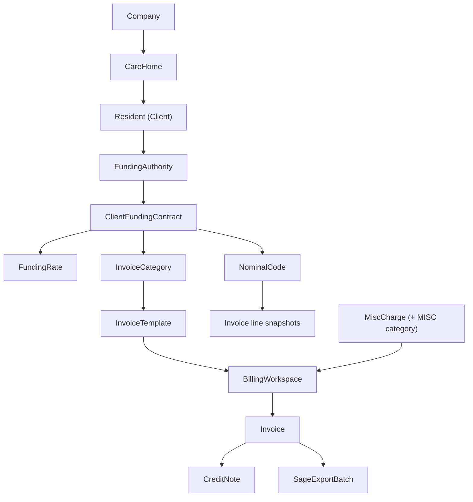

# CareHome — Current Product Architecture Audit (Read-Only)

**Audit date:** 2026-09-23  
**Scope:** V1 product navigation (Revenue / Revenue Assurance intentionally hidden)  
**Code changes in this phase:** None (documentation only)

---

## 1. Executive summary

CareHome is a multi-tenant care-home billing application with a **modular .NET backend** (`CareHome.Api` host + domain libraries) and an **Angular SPA** (`frontend/care-home-web`).

| Stated stack (brief) | Observed in repository |
|----------------------|-------------------------|
| Angular 20 | **Angular ~22** (`package.json`) |
| .NET 8 Web API | **.NET 10** (`TargetFramework: net10.0`) |
| SQL Server + EF Core | Yes — `CareHome.Data` migrations |
| JWT + RBAC | Yes — global `[Authorize]` + policies + `ReadOnlyGuardFilter` |

**V1 navigation** is implemented in `frontend/care-home-web/src/app/app.html` and `app.routes.ts`. **Commercial revenue cycle** (AR, payments, banking, remittances, collections, disputes, revenue assurance, contract renewals) exists in code but is **gated off**:

- Frontend: `COMMERCIAL_REVENUE_ENABLED = false` in `core/commercial-revenue.feature.ts`
- Backend: `Features:CommercialRevenueEnabled: false` in `appsettings.json` + `CommercialRevenueApiGateMiddleware`

Routes for hidden modules remain registered but redirects apply via `commercialRevenueGuard`; API paths return blocked when the feature flag is false.

---

## 2. Solution layout

```
CarehomeSystem/
├── frontend/care-home-web/          # Angular SPA
├── backend/
│   ├── CareHome.Api/                # HTTP API, PDF, Sage export, seeders, some workflows
│   ├── CareHome.Data/               # EF Core DbContext, entities, migrations (namespace CareHome.Api.Models)
│   ├── CareHome.Abstractions/       # IAuditWriter, ITenantContext, ICareHomeAccessScope, etc.
│   ├── CareHome.Billing/            # BillingService, CreditNoteService, template resolver
│   ├── CareHome.Funding/            # Funding contracts & rates
│   ├── CareHome.Payments/
│   ├── CareHome.Receivables/
│   ├── CareHome.Reconciliation/
│   ├── CareHome.Remittance/
│   └── CareHome.RevenueAssurance/
└── CareHome.Api.Tests/              # Unit + SQL integration tests
```

Entity classes live under `backend/CareHome.Data/Models/` with `RootNamespace` **CareHome.Api** so they appear as `CareHome.Api.Models` in the API layer.

---

## 3. Dependency map (billing chain)

Logical product dependency (data must exist in order for billing to succeed):



**Notes on the chain:**

- **Funding authority** is master data; contracts link **resident + authority + category + nominal** (optional template override on contract).
- **Invoice templates** resolve at billing time by category, then specificity: care home + authority → authority only → care home only → company → tenant default (`InvoiceTemplateResolver`).
- **Billing workspace** groups invoice lines by funding authority + invoice category + resolved template (`BillingService`).
- **Invoice lines** snapshot `SageId`, nominal code, client name, etc. at generation time (critical for **Sage export**).
- **Misc charges** bill through the **MISC** invoice category (`DefaultInvoiceCategories.MiscellaneousCode`).
- **Credit notes** attach to a single invoice; lines reference `InvoiceLine` with remaining-credit rules.
- **Sage export** marks invoices with `SageExportBatchId` / `SageExportedAt`; CSV uses line snapshots.

---

## 4. Commercial revenue gating (do not re-enable in V1)

| Layer | Mechanism | Key files |
|-------|-----------|-----------|
| UI nav | `@if (showCommercialRevenueNav)` | `app.html`, `app.ts` |
| UI routes | `commercialRevenueGuard` | `app.routes.ts`, `commercial-revenue.guard.ts` |
| API | `CommercialRevenueApiGateMiddleware` | `Middleware/CommercialRevenueApiGateMiddleware.cs` |
| Config | `Features:CommercialRevenueEnabled` | `appsettings.json`, `CommercialRevenueFeature.cs` |
| Dashboard | Legacy vs receivables outstanding | `DashboardController.cs` |

Blocked API prefixes when disabled: `/api/receivables`, `/api/payments`, `/api/banking`, `/api/remittances`, `/api/collections`, `/api/disputes`, `/api/revenue-assurance`, `/api/contract-renewals`, `/api/finance`.

---

## 5. Navigation configuration

| Section | Nav source | Collapse state signals |
|---------|------------|-------------------------|
| Dashboard | `app.html` | — |
| Operations | Companies, Care Homes, Residents | `operationsOpen` |
| Billing setup | Funding Authorities, Nominal Codes, Invoice Categories, Invoice Templates | `billingSetupOpen` |
| Billing | Billing Workspace, Invoices, Credit Notes, Misc Charges | `billingOpen` |
| Reporting | Reports, Sage Export | `reportingOpen` |
| Administration | Users, Audit, Organisation Settings | `adminOpen` |
| Platform | Organisations (platform admin only) | top link when `isPlatformAdmin()` |

Residents use route prefix **`/clients`** (API: `/api/clients`); UI label is “Residents”.

---

## 6. Section-by-section audit

### 6.1 Dashboard

| Area | Detail |
|------|--------|
| **Frontend routes** | `/dashboard` → `features/dashboard/dashboard.ts` |
| **Related** | `/care-homes/:id/dashboard` → `care-home-dashboard.ts` |
| **Backend** | `GET /api/dashboard`, `GET /api/dashboard/care-homes/{id}` — `DashboardController` |
| **DTOs** | `Dtos/Dashboard/DashboardDtos.cs` |
| **Entities** | `CareHomeLocation`, `Client`, `Invoice` (aggregations) |
| **Tables** | `CareHomes`, `Clients`, `Invoices` |
| **Business rules** | Occupancy = current non-archived clients vs bed capacity; care-home scope via `UserAccessService`; outstanding invoices use legacy payment-status query when commercial revenue disabled |
| **Permissions** | Authenticated tenant user; scoped care homes for location managers |
| **Tests** | No dedicated dashboard API tests observed |
| **Gaps** | Dashboard links to commercial modules only when feature enabled |
| **Regression risks** | Toggling `CommercialRevenueEnabled` changes outstanding metrics source |

---

### 6.2 OPERATIONS — Companies

| Area | Detail |
|------|--------|
| **Frontend** | `/companies`, `/companies/new`, `/companies/:id`, `/companies/:id/edit`, `/companies/:id/care-homes` — `features/companies/pages/*` |
| **Service** | `company.service.ts` → `/api/companies` |
| **Backend** | `CompaniesController` — GET list/detail, POST, PUT, DELETE (deactivate) |
| **DTOs** | `Dtos/Companies/CompanyDto.cs`, `CreateCompanyRequest`, `UpdateCompanyRequest` |
| **Entity** | `Company` — tenant-scoped, unique `(TenantId, Name)`, `PublicId` |
| **Table** | `Companies` |
| **Migrations** | `InitialCreate`, `AddUniqueCompanyName`, multi-tenancy alignments, `AddEntityPublicIdsAndPortalTheme` |
| **Relationships** | `Company` 1→* `CareHomeLocation`, 1→* `InvoiceTemplate` |
| **Validation** | Unique company name per tenant; deactivate pattern |
| **Permissions** | Default authenticated; writes blocked for ReadOnly via global filter |
| **Audit** | Create, Update, Deactivate on `Company` |
| **Tests** | `company-list.spec.ts`, `company-form.spec.ts` |
| **Gaps** | — |
| **Risks** | Deactivating company with active care homes may block operations depending on UI filters (`activeOnly`) |

---

### 6.3 OPERATIONS — Care Homes

| Area | Detail |
|------|--------|
| **Frontend** | `/care-homes`, `/care-homes/new`, `/care-homes/:id/edit`, `/care-homes/:id/dashboard`, `/care-homes/:id/settings` |
| **Service** | `care-home.service.ts` |
| **Backend** | `CareHomesController` — CRUD, `PUT .../portal-appearance` |
| **DTOs** | `Dtos/CareHomes/CareHomeDto.cs`, `UpdateCareHomeRequest`, portal appearance request |
| **Entity** | `CareHomeLocation` — belongs to `Company`, unique `(TenantId, Code)` |
| **Table** | `CareHomes` |
| **Migrations** | `AddCareHomes`, public IDs, portal theme |
| **Relationships** | *→`Company`; 1→* `Client`; `UserCareHomeAccess` for location managers |
| **Business rules** | Portal accent theme; logo paths on disk via document store |
| **Permissions** | `CanManageCareHome` policy on mutating endpoints (where applied); access scope enforced in queries |
| **Audit** | Create, Update, Deactivate, portal appearance |
| **Tests** | `care-home-list.spec.ts`, `care-home-form.spec.ts` |
| **Gaps** | — |
| **Risks** | Location manager scope: users without access to a home should not see its billing data (enforced in billing/Sage via `ICareHomeAccessScope`) |

---

### 6.4 OPERATIONS — Residents (Clients)

| Area | Detail |
|------|--------|
| **Frontend** | `/clients`, `/clients/new`, `/clients/:id`, `/clients/:id/edit`, `/clients/:id/funding/new`, `/clients/:id/funding/rates/new` — `client-profile` embeds contracts |
| **Service** | `client.service.ts` |
| **Backend** | `ClientsController` — CRUD; funding via `FundingContractsController` |
| **DTOs** | `Dtos/Clients/ClientDto.cs` |
| **Entity** | `Client` — `SageId`, `ReferenceNumber`, dates, `CareHomeId`, status |
| **Table** | `Clients` |
| **Migrations** | `AddClients`, `ConvertClientDatesToDateOnly` |
| **Relationships** | `Client` → `CareHome`; 1→* `ClientFundingContract` |
| **Validation** | Unique `SageId` and `ReferenceNumber` per tenant; admission/discharge dates |
| **Permissions** | Care-home scoped access for location managers |
| **Audit** | Client create/update/deactivate |
| **Tests** | `client-list`, `client-form`, `client-profile` specs |
| **Gaps** | UI “Residents” vs API “clients” naming |
| **Risks** | Missing or duplicate `SageId` blocks Sage export at line level |

**Funding contracts (resident sub-flow)**

| Area | Detail |
|------|--------|
| **API** | `GET/POST /api/clients/{clientId}/funding-contracts`, `GET/PUT /api/funding-contracts/{id}`, `GET/POST /api/funding-contracts/{id}/rates` |
| **Service** | `CareHome.Funding/FundingContractService.cs` |
| **DTOs** | `CareHome.Funding/Dtos/FundingContracts/FundingContractDtos.cs` |
| **Entities** | `ClientFundingContract`, `FundingRate` |
| **Tables** | `ClientFundingContracts`, `FundingRates` |
| **Migrations** | `AddFundingMasterData` |
| **Business rules** | No overlapping active contract for same client + funding authority + invoice category (`FundingContractOverlap`); rate periods cannot overlap on same contract; SQL app lock on create |
| **Audit** | Contract create/update; rate create |
| **Tests** | `FundingContractOverlapTests.cs` |

---

### 6.5 BILLING SETUP — Funding Authorities

| Area | Detail |
|------|--------|
| **Frontend** | `/funding-authorities`, `/funding-authorities/new`, `/funding-authorities/:id/edit` |
| **Service** | `funding-authority.service.ts` |
| **Backend** | `FundingAuthoritiesController` — list (supports `activeOnly`), get by int id or `PublicId` guid key, CRUD |
| **DTOs** | `FundingAuthorityDto`, create/update requests |
| **Entity** | `FundingAuthority` — `Code`, `Type`, `BillingFrequency`, `PublicId` |
| **Table** | `FundingAuthorities` |
| **Migrations** | `AddFundingMasterData`, `AddFundingAuthorityPublicIdAndInvoiceLineAmountBasis` |
| **Relationships** | 1→* contracts; referenced on invoices |
| **Validation** | Unique code per tenant |
| **Audit** | Create, Update, Deactivate |
| **Tests** | No dedicated controller tests |
| **Gaps** | Delete is soft-deactivate only |
| **Risks** | Deactivated authority still referenced by historical invoices |

---

### 6.6 BILLING SETUP — Nominal Codes

| Area | Detail |
|------|--------|
| **Frontend** | `/nominal-codes`, `/nominal-codes/new`, `/nominal-codes/:id/edit` |
| **Service** | `nominal-code.service.ts` |
| **Backend** | `NominalCodesController` |
| **DTOs** | `NominalCodeDto`, create/update |
| **Entity** | `NominalCode` |
| **Table** | `NominalCodes` |
| **Relationships** | Required on funding contracts; optional on misc charges; snapshotted on invoice lines |
| **Validation** | Unique `(TenantId, Code)` |
| **Audit** | Create, Update, Deactivate |
| **Tests** | None specific |
| **Gaps** | No UI warning when deactivating codes in use |
| **Risks** | `MISSING_NOMINAL` billing exception; Sage export blocked if snapshot empty |

---

### 6.7 BILLING SETUP — Invoice Categories

| Area | Detail |
|------|--------|
| **Frontend** | `/invoice-categories`, new, edit |
| **Service** | `invoice-category.service.ts` |
| **Backend** | `InvoiceCategoriesController` |
| **DTOs** | `InvoiceCategoryDto`, create/update |
| **Entity** | `InvoiceCategory` |
| **Table** | `InvoiceCategories` |
| **Seed** | `DefaultInvoiceCategories` on tenant provision (`TenantProvisioningService`) — GENERAL_CARE, OUTREACH, RENT, MISC |
| **Relationships** | On contracts, templates, invoices |
| **Validation** | Unique code per tenant; delete = deactivate |
| **Audit** | Create, Update, Deactivate |
| **Tests** | None specific |
| **Gaps** | Changing code of seeded MISC category would break misc billing |
| **Risks** | `MISSING_CATEGORY` if MISC missing |

---

### 6.8 BILLING SETUP — Invoice Templates

| Area | Detail |
|------|--------|
| **Frontend** | `/invoice-templates`, new, edit |
| **Backend** | `InvoiceTemplatesController` |
| **DTOs** | `InvoiceTemplateDtos.cs` |
| **Entity** | `InvoiceTemplate` — branding, bank details, email templates, scoped FKs |
| **Table** | `InvoiceTemplates` |
| **Resolver** | `InvoiceTemplateResolver` (precedence rules) |
| **Relationships** | FK to category; optional authority, care home, company |
| **Validation** | Name required; deactivate instead of hard delete |
| **Audit** | Create, Update, Deactivate |
| **PDF** | `InvoicePdfService` uses template + invoice snapshots |
| **Tests** | `InvoicePdfRenderingTests.cs` |
| **Gaps** | Contract can pin `InvoiceTemplateId`; resolver still used when not pinned |
| **Risks** | `MISSING_TEMPLATE` billing error if no match |

---

### 6.9 BILLING — Billing Workspace

| Area | Detail |
|------|--------|
| **Frontend** | `/billing` — `billing-workspace.ts` (preview → review → generate workflow) |
| **API** | `POST /api/billing/preview`, `POST /api/billing/generate` |
| **Backend** | `BillingController` + `CareHome.Billing/BillingService.cs` |
| **DTOs** | `CareHome.Billing/Dtos/Billing/BillingDtos.cs` |
| **Supporting** | `RateCalculator`, `BillingPreviewRequestValidator`, `DocumentSequence` for invoice numbers |
| **Tables** | `Invoices`, `InvoiceLines`, `BillingExceptionLogs`, `MiscCharges`, `DocumentSequences` |
| **Permissions** | Preview: `CanViewFinancialReports`; Generate: `CanManageBilling` |
| **Exception codes** | `INVALID_PERIOD`, `INVALID_COMPANY`, `MISSING_CONTRACT`, `MISSING_NOMINAL`, `MISSING_TEMPLATE`, `ALREADY_FULLY_BILLED`, `PARTIAL_PERIOD_BILLING`, `MISSING_RATE`, `MISSING_CATEGORY` (misc) |
| **Business rules** | Tenant SQL app lock per billing run; logs all exceptions to `BillingExceptionLogs`; blocks generate on Error severity; groups invoices by authority/category/template; pro-rates by rate frequency and service dates |
| **Audit** | Invoice generation batch logged |
| **Tests** | Covered indirectly in integration/hardening tests; see `docs/BILLING_ENGINE.md` |
| **Gaps** | No Angular unit test for workspace |
| **Risks** | Concurrent billing runs (mitigated by lock); partial period warnings vs errors |

---

### 6.10 BILLING — Invoices

| Area | Detail |
|------|--------|
| **Frontend** | `/invoices`, `/invoices/:id` |
| **API** | `InvoicesController` — paged list, detail (id or publicId), PDF, send, bulk-send, payment-status, void |
| **DTOs** | `Dtos/Invoices/InvoiceDtos.cs` |
| **Entities** | `Invoice`, `InvoiceLine` |
| **Tables** | `Invoices`, `InvoiceLines` |
| **Dependencies** | Templates for PDF/email; sequences; care-home scope on list |
| **Business rules** | `InvoiceVoidRules`; payment status fields (legacy when AR disabled); email via `IEmailSender` + `EmailSendLogs` |
| **Permissions** | Financial reports for read; manage billing for void/send (per-action attributes) |
| **Audit** | Payment status, void, send |
| **Tests** | `InvoicePdfRenderingTests.cs`, integration tests |
| **Gaps** | Bulk operations UX depends on selection state |
| **Risks** | Void after Sage export; payment status vs future AR allocations |

---

### 6.11 BILLING — Credit Notes

| Area | Detail |
|------|--------|
| **Frontend** | `/credit-notes` — single workspace (preview + generate + list) |
| **API** | `CreditNotesController` — list, get, preview, generate, PDF, send |
| **Service** | `CreditNoteService.cs` |
| **DTOs** | `CareHome.Billing/Dtos/CreditNotes/CreditNoteDtos.cs` |
| **Entities** | `CreditNote`, `CreditNoteLine` |
| **Tables** | `CreditNotes`, `CreditNoteLines` |
| **Business rules** | Reason required; cannot credit more than remaining per line; **single invoice per credit note**; void status excluded from already-credited sums |
| **Permissions** | View: `CanViewFinancialReports`; write: `CanManageBilling` |
| **Audit** | Generate/send |
| **Tests** | Limited direct coverage |
| **Risks** | Amount sign convention on lines (negative amounts in DB) |

---

### 6.12 BILLING — Miscellaneous Charges

| Area | Detail |
|------|--------|
| **Frontend** | `/misc-charges` — import preview/confirm |
| **API** | `MiscChargesController` — `imports`, `import/preview`, `import/confirm` |
| **Service** | `MiscChargeImportService` (Api project) |
| **DTOs** | `Dtos/MiscCharges/MiscChargeDtos.cs` |
| **Entities** | `MiscCharge`, `MiscChargeImportBatch` |
| **Tables** | `MiscCharges`, `MiscChargeImportBatches` |
| **Migration** | `UniqueMiscChargeDedupeIndex` — unique on tenant, client, date, description, amount |
| **Relationships** | `NominalCodeId` on charge; picked up in billing for MISC category |
| **Audit** | Import confirm |
| **Tests** | Dedupe behavior via migration/index |
| **Gaps** | No inline CRUD UI for single charges |
| **Risks** | Duplicate import rows rejected silently vs error — depends on service messaging |

---

### 6.13 REPORTING — Reports

| Area | Detail |
|------|--------|
| **Frontend** | `/reports` |
| **API** | `ReportsController` — `client-census`, `current-rates`, `invoices-by-client`, `invoices-by-care-home`, `income-by-category`, `occupancy`, `rate-history`, `billing-exceptions`, `outstanding` |
| **DTOs** | `Dtos/Reports/ReportDtos.cs` |
| **Permissions** | `CanViewFinancialReports` on controller |
| **Dependencies** | All operational + billing tables |
| **Tests** | None dedicated |
| **Gaps** | Export format = CSV blob from same endpoints |
| **Risks** | `outstanding` report semantics differ when commercial revenue enabled |

---

### 6.14 REPORTING — Sage Export

| Area | Detail |
|------|--------|
| **Frontend** | `/sage-exports` |
| **API** | `SageExportsController` — preview, POST export, list batches, download file |
| **Service** | `Export/SageExportService.cs`, `Sage50ColumnMap.cs` |
| **DTOs** | `Export/SageDtos.cs` |
| **Entities** | `SageExportBatch`; invoice fields `SageExportBatchId`, `SageExportedAt` |
| **Table** | `SageExportBatches` |
| **Dependencies** | Invoice line snapshots: `SnapshotSageId`, `SnapshotNominalCode`; non-void invoices; date range; optional company/care home/status filters; care-home access scope |
| **Business rules** | SQL lock `sage-export-{tenantId}`; marks invoices in DB before writing CSV; `CanExport` requires zero validation errors; already-exported rows excluded unless `includeAlreadyExported` |
| **Audit** | Sage export batch |
| **Docs** | `docs/SAGE50_EXPORT.md` |
| **Tests** | No dedicated Sage export test file |
| **Risks** | `FileMissing` batch status if disk write fails after DB commit |

---

### 6.15 ADMINISTRATION — Users

| Area | Detail |
|------|--------|
| **Frontend** | `/users`, `/users/new` — `adminGuard` |
| **API** | `UsersController` — CRUD, deactivate, reset password |
| **DTOs** | `Dtos/Users/UserDtos.cs` |
| **Entities** | `ApplicationUser` (Identity), `UserCareHomeAccess` |
| **Tables** | `AspNetUsers`, `AspNetUserRoles`, `UserCareHomeAccess` |
| **Roles** | Assignable: TenantAdmin, Administrator, LocationManager, ReadOnly |
| **Business rules** | LocationManager requires ≥1 care home; password reset + optional must-change-password |
| **Audit** | User lifecycle events |
| **Tests** | Auth/login tests; no full user CRUD integration |
| **Risks** | Role rename (`SuperAdmin` → `PlatformAdmin` legacy mapping) |

---

### 6.16 ADMINISTRATION — Audit

| Area | Detail |
|------|--------|
| **Frontend** | `/audit` — `audit-list` |
| **API** | `GET /api/audit` — filter `entityType`, `action`, paged |
| **DTO** | `AuditLogDto` (no old/new JSON in list) |
| **Entity** | `AuditLog` |
| **Table** | `AuditLogs` |
| **Writer** | `AuditService` implements `IAuditWriter` — JSON snapshots, skips if no tenant |
| **Permissions** | `CanViewAudit` (TenantAdmin, Administrator) |
| **Coverage gaps** | Not all reads logged; list DTO omits `OldValues`/`NewValues`; billing exceptions go to `BillingExceptionLogs` not audit |
| **Risks** | Audit `SaveChanges` per log call (extra round-trips) |

---

### 6.17 ADMINISTRATION — Organisation Settings

| Area | Detail |
|------|--------|
| **Frontend** | `/settings/organisation` — `organisationSettingsGuard` |
| **API** | `OrganisationSettingsController` — GET/PUT |
| **Entity** | `Tenant`, `TenantSettings` — currency, prefixes, payment terms, timezone |
| **Tables** | `Tenants`, `TenantSettings` |
| **Permissions** | `CanManageOrganisation` |
| **Dependencies** | `DocumentSequences` updated when prefixes change (verify in controller) |
| **Risks** | Prefix change mid-year numbering |

---

### 6.18 Platform (out of V1 menu for tenants)

| Area | Detail |
|------|--------|
| **Frontend** | `/platform/tenants` — `platformGuard` |
| **API** | `PlatformTenantsController` |
| **Service** | `TenantProvisioningService` seeds categories + document sequences |
| **Note** | Platform admins may have no `tenantPublicId`; home path → platform tenants |

---

## 7. Hidden modules (present, must stay hidden in V1)

These are **implemented** but must **not** be exposed in V1 product navigation or enabled via feature flags without an explicit phase gate.

| Module | Frontend route | Backend prefix | Library |
|--------|----------------|----------------|---------|
| Accounts Receivable | `/receivables` | `/api/receivables` | CareHome.Receivables |
| Payments | `/payments` | `/api/payments` | CareHome.Payments |
| Banking | `/banking` | `/api/banking` | CareHome.Reconciliation |
| Remittances | `/remittances` | `/api/remittances` | CareHome.Remittance |
| Collections | `/collections` | `/api/collections` | Api `CollectionsWorkflowService` |
| Disputes | `/disputes` | `/api/disputes` | Api `DisputeWorkflowService` |
| Revenue Assurance | `/revenue-assurance` | `/api/revenue-assurance` | CareHome.RevenueAssurance |
| Contract renewals | `/contract-renewals` | `/api/contract-renewals` | Api `ContractRenewalWorkflowService` |
| Finance attention | (dashboard/widgets) | `/api/finance` | `FinanceAttentionService` |

**Do not** set `COMMERCIAL_REVENUE_ENABLED` or `CommercialRevenueEnabled` to true in V1 deployments.

---

## 8. Database migrations (chronological)

| Migration | Theme |
|-----------|--------|
| `20260818163255_InitialCreate` | Identity + core |
| `20260820171351_AddCareHomes` | Care homes |
| `20260820175610_AddClients` | Clients |
| `20260827133532_AddUniqueCompanyName` | Company uniqueness |
| `20260828032941_ConvertClientDatesToDateOnly` | Date types |
| `20260828040328_AddFundingMasterData` | Funding, categories, nominal, contracts, rates, templates, billing |
| `20260829072440_AddMultiTenancy` | Tenants |
| `20260829105950_RemoveUnusedHistoricalCustomerSeedCompanies` | Seed cleanup |
| `20260829120000_AddOperationalDomain` | Invoices, credit notes, Sage, audit, misc |
| `20260829180000_AlignOperationalTenantSchema` | Tenant FK alignment |
| `20260902032700_AddMustChangePassword` | Security |
| `20260911053954_UniqueMiscChargeDedupeIndex` | Misc charge dedupe |
| `20260921100000_AddEntityPublicIdsAndPortalTheme` | Public IDs, portal |
| `20260921152558_AddPayments` | Payments domain |
| `20260921154317_AddBankReconciliation` | Banking |
| `20260921163828_CommercialRevenueCycleExtensions` | AR, remittance, disputes, assurance, renewals |
| `20260922151354_AddFundingAuthorityPublicIdAndInvoiceLineAmountBasis` | Authority GUID + line basis text |

Snapshot: `CareHomeDbContextModelSnapshot.cs` (authoritative schema).

---

## 9. Cross-cutting concerns

### 9.1 Authentication & authorization

- **JWT** bearer; login password encrypted client-side (`login-key` + cipher).
- **Global** authentication required on controllers (`AuthorizeFilter`).
- **Policies** in `CareHomeAuthorizationExtensions.cs` (`CareHomePolicies.*`).
- **ReadOnly** role: GET allowed; POST/PUT/PATCH/DELETE → 403 (`ReadOnlyGuardFilter`), except change-password.
- **Tenant**: `[RequireTenant]` + `ITenantContext` on tenant APIs.
- **Care-home scope**: `UserAccessService` / `ICareHomeAccessScope` — location managers limited to `UserCareHomeAccess`.

### 9.2 API contracts

- JSON over REST; pagination via `PagedResult<T>` (`page`, `pageSize`).
- Entity routes: mix of **int id** and **PublicId** guid (`entity-route.ts` on frontend).
- Errors: `{ message }` or ProblemDetails via `ApiExceptionHandler`.

### 9.3 Tests (existing)

**Backend (`CareHome.Api.Tests`):**

- `TenantIsolationTests`, `FundingContractOverlapTests`, `PaymentDomainTests`, `ReceivableDomainTests`, `ReconciliationDomainTests`
- Integration: `ApiIntegrationTests`, `PaymentsIntegrationTests`, `ReceivablesIntegrationTests`, `ReconciliationIntegrationTests`, `RemittanceIntegrationTests`
- `InvoicePdfRenderingTests`, `CriticalPathHardeningTests`, `ProductionHardeningTests`, `LoginPasswordCipherTests`

**Frontend:** Karma/Jasmine specs for auth, login, several company/care-home/client list/form pages — **no** billing/Sage E2E in repo.

---

## 10. Implementation gaps (V1-focused)

1. **Sage export** — no automated test for CSV eligibility rules or batch/file failure recovery.
2. **Master data** — nominal/category deactivate does not surface “in use” warnings in UI.
3. **Audit** — list view omits `OldValues`/`NewValues`; not all entities audited (e.g. organisation settings).
4. **Billing** — exception log separate from audit UI (`reports/billing-exceptions` vs `/audit`).
5. **Commercial revenue** — dual code paths (dashboard outstanding, payment status on invoices) remain while AR disabled.
6. **Documentation drift** — product brief mentions .NET 8 / Angular 20; repo targets newer versions.
7. **Hidden routes** — still reachable if feature flag flipped accidentally (no compile-time removal).

---

## 11. Potential regression risks

| Risk | Impact | Mitigation |
|------|--------|------------|
| Enable commercial revenue flags | Exposes nav + APIs; changes dashboard metrics | Keep flags false; code review any `Features` / `commercial-revenue.feature.ts` change |
| MISC category code change | Misc billing + imports break | Treat `MISC` as immutable |
| Invoice template resolver order change | Wrong branding on PDFs | Test matrix: company/home/authority combinations |
| Funding overlap rules relaxed | Double billing same period | Keep `FundingContractOverlapTests` green |
| Sage export concurrency | Duplicate exports | Keep SQL app lock |
| Tenant migration on production | Schema drift | Use `scripts/apply-database-migrations-on-host.sh` / `--apply-migrations` |
| ReadOnly role mis-assignment | Users blocked from writes unexpectedly | Role assignment UI + tests |
| Location manager scope bugs | Data leak across homes | Tenant + care-home filters on invoices/billing/Sage |

---

## 12. Recommended implementation order (future phases)

**Phase A — V1 hardening (no new modules)**  
1. Master data UX (nominal/category/template in-use indicators).  
2. Sage export + billing integration tests.  
3. Audit completeness for settings and billing generate.  
4. Align public docs with actual Angular/.NET versions.

**Phase B — Billing depth (still V1 nav)**  
1. Credit note edge cases + voided invoice rules.  
2. Misc charge manual entry (if required by product).  
3. Invoice void vs Sage exported state policy.

**Phase C — Commercial revenue (explicit product gate)**  
1. Enable `CommercialRevenueEnabled` in staging only.  
2. Receivables → Payments → Banking → Remittances (dependency order per `docs/revenue-cycle/`).  
3. Collections, Disputes.  
4. Revenue Assurance + Renewals last.

**Do not** start Phase C until V1 billing + Sage sign-off is complete.

---

## 13. Files likely to change by future phase

### Phase A (V1 hardening)

| Area | Likely files |
|------|----------------|
| Nominal/category | `NominalCodesController.cs`, `InvoiceCategoriesController.cs`, `nominal-code-*.ts`, `invoice-category-*.ts` |
| Sage tests | `SageExportService.cs`, new tests under `CareHome.Api.Tests` |
| Audit | `OrganisationSettingsController.cs`, `audit-list.ts`, `AuditLogDto.cs` |
| Docs | `docs/BUSINESS_RULES.md`, `docs/API_GUIDE.md` |

### Phase B (billing)

| Area | Likely files |
|------|----------------|
| Billing | `BillingService.cs`, `billing-workspace.ts`, `BillingDtos.cs` |
| Credit notes | `CreditNoteService.cs`, `credit-note-workspace.ts` |
| Invoices | `InvoicesController.cs`, `InvoiceVoidRules.cs`, `invoice-detail.ts` |
| Misc | `MiscChargeImportService.cs`, `misc-charges.ts` |

### Phase C (commercial revenue — only when approved)

| Area | Likely files |
|------|----------------|
| Feature flags | `commercial-revenue.feature.ts`, `appsettings.json`, `CommercialRevenueApiGateMiddleware.cs` |
| Nav | `app.html`, `app.routes.ts` |
| Dashboard | `DashboardController.cs`, `dashboard.ts` |
| Domain | `CareHome.Receivables/*`, `CareHome.Payments/*`, `CareHome.Reconciliation/*`, `CareHome.Remittance/*`, `CareHome.RevenueAssurance/*`, related controllers |

---

## 14. Files that should NOT be changed (without strong reason)

| File / area | Reason |
|-------------|--------|
| `FundingContractOverlap.cs`, overlap tests | Prevents double-funding contracts |
| `CommercialRevenueFeature.cs` gate list | Prevents accidental API exposure |
| `DefaultInvoiceCategories.cs` | Tenant seed + MISC billing dependency |
| `InvoiceTemplateResolver.cs` precedence | Stable billing/PDF behaviour |
| `CareHomeDbContext.cs` relationship delete behaviours | `Restrict` prevents orphan/cascade data loss |
| `ReadOnlyGuardFilter.cs` | Production RBAC contract |
| `DocumentSequence` / numbering in billing generate | Invoice/credit note legal numbering |
| `Sage50ColumnMap.cs` | External finance system contract |
| Migration history (never edit applied migrations) | EF integrity |

---

## 15. Quick reference — V1 API map

| UI area | Base API route |
|---------|----------------|
| Dashboard | `/api/dashboard` |
| Companies | `/api/companies` |
| Care homes | `/api/care-homes` |
| Residents | `/api/clients` |
| Funding contracts | `/api/clients/{id}/funding-contracts`, `/api/funding-contracts/{id}` |
| Funding authorities | `/api/funding-authorities` |
| Nominal codes | `/api/nominal-codes` |
| Invoice categories | `/api/invoice-categories` |
| Invoice templates | `/api/invoice-templates` |
| Billing | `/api/billing` |
| Invoices | `/api/invoices` |
| Credit notes | `/api/credit-notes` |
| Misc charges | `/api/misc-charges` |
| Reports | `/api/reports/{reportKey}` |
| Sage | `/api/sage-exports` |
| Users | `/api/users` |
| Audit | `/api/audit` |
| Organisation | `/api/settings/organisation` |
| Auth | `/api/auth` |

---

## 16. Findings summary

1. **V1 navigation is fully wired** to backend APIs with consistent tenant scoping and role policies.  
2. **Billing is the integration hub** — contracts, rates, categories, nominals, templates, and misc charges converge in `BillingService`.  
3. **Sage export depends on generation-time snapshots**, not live master data.  
4. **Commercial revenue is a parallel product layer** already built but correctly **feature-flagged off** on UI and API.  
5. **EF schema is mature** with 17 migrations; commercial extensions coexist in the same database.  
6. **Test coverage is strongest** on funding overlap, payments/receivables integration, and tenant isolation — **weaker** on Sage and nominal/category CRUD.

---

## 17. Related existing documentation

- `docs/DATABASE_MODEL.md` — entity reference  
- `docs/BILLING_ENGINE.md` — billing behaviour  
- `docs/BUSINESS_RULES.md` — business rules catalogue  
- `docs/SAGE50_EXPORT.md` — Sage column mapping  
- `docs/revenue-cycle/*` — commercial phase plans (do not execute in V1)  
- `docs/API_GUIDE.md` / `docs/FRONTEND_GUIDE.md` — developer guides  

This audit supersedes none of the above; it maps **current code** to **V1 product sections** for planning only.
