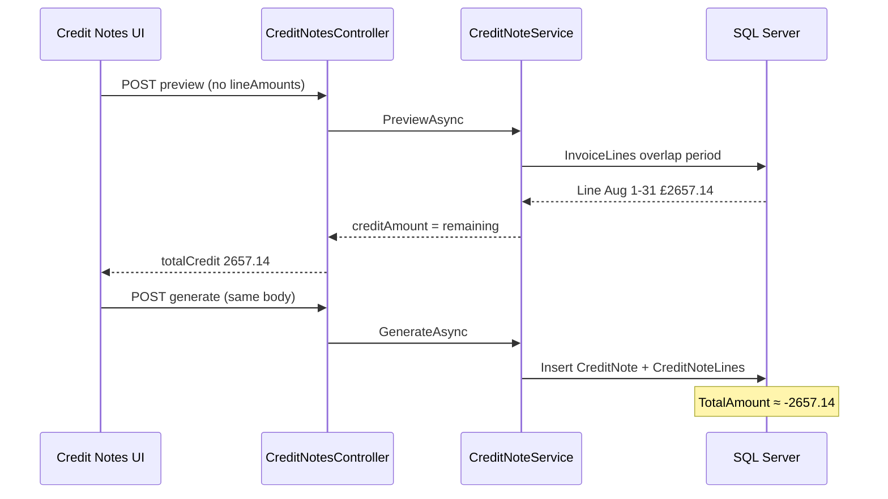

# Credit Note Investigation

**Investigation date:** 16 September 2026  
**Scope:** Read-only code and documentation review — no changes to code, data, APIs, UI, or business rules.  
**Focus:** Demo credit note **CN-0001** — expected **£600.00** vs observed risk of **£2,657.14** (full **INV-0002** line).  
**References:** `../demo/CLIENT_DEMO_OPERATOR_RUNBOOK.md` (Part 7), `../demo/DEMO_DATA_PREPARATION_GUIDE.md` (§9), `CLIENT_DEMO_DRY_RUN_REPORT.md` (step 15, §5).

---

## 1. Executive Finding

The **£600.00** target for CN-0001 is a **finance narrative** in the demo guides (7 days × £600/week ÷ 7). The **implemented product behaviour** does **not** prorate credit amounts by the credit-note **period** dates.

When the UI calls preview/generate **without** `lineAmounts`, the API sets each eligible invoice line’s credit to the **full remaining creditable balance** on that line. For Jordan Blake’s August 2026 invoice (**INV-0002**), billing produces a **single invoice line** for **2026-08-01 – 2026-08-31** totalling **£2,657.14**. A credit period of **2026-08-25 – 2026-08-31** still **matches** that line (service period overlap) but does **not** reduce the credited amount to seven days. Preview and generate therefore show **£2,657.14** credit, not **£600.00**.

**Partial credits are supported by the API** via optional `lineAmounts` (invoice line id → amount). The **Credit Notes** Angular workspace **never sends** `lineAmounts` and provides **no controls** to enter per-line credit amounts. **CN-0001 at £600.00 cannot be created through the current UI** using only the documented demo steps.

**Root cause classification (combined):**

| Factor | Role |
|--------|------|
| **UI gap** | Primary — missing `lineAmounts` payload and no amount entry UX |
| **Documentation / demo script** | Secondary — implies period narrowing yields £600 proration |
| **API design** | Intentional default — omit `lineAmounts` ⇒ credit full remaining per matched line (UAT TC-193) |
| **Backend calculation bug** | **No** — behaviour matches `CreditNoteService` logic |
| **Business-rule mismatch** | Demo finance story assumes day-proration; credit engine does not |

`../demo/CLIENT_DEMO_OPERATOR_RUNBOOK.md` Part 7 already documents this mismatch; `CLIENT_DEMO_DRY_RUN_REPORT.md` lists CN-0001 as unverified on the review machine but does not isolate the UI/API mechanism.

---

## 2. Current UI Request

**Route:** `/credit-notes` (`CreditNoteWorkspacePage`)

**Preview** (`POST /api/credit-notes/preview`) and **Generate** (`POST /api/credit-notes/generate`) send the **same JSON body**:

| Field | Sent by UI? | Demo value (CN-0001) |
|-------|-------------|----------------------|
| `clientId` | Optional — number or `null` | Jordan’s numeric client id |
| `periodStart` | Yes | `2026-08-25` |
| `periodEnd` | Yes | `2026-08-31` |
| `reason` | Yes | `Partial period adjustment — 7 days not billable (demo)` |
| `creditNoteDate` | Yes — set to `periodEnd` | `2026-08-31` |
| `lineAmounts` | **No** | *(not in payload)* |
| `fundingAuthorityId` | No | — |
| `invoiceCategoryId` | No | — |

**UI behaviour:**

- Preview renders `creditAmount` and `remainingAmount` from the API response (read-only table).
- Generate is enabled only when `preview.canGenerate` is true.
- No input for partial amount, days, or per-line credit.

**Source:** `frontend/care-home-web/src/app/features/credit-notes/pages/credit-note-workspace/credit-note-workspace.ts` (lines 54–79).

---

## 3. API Behaviour

**Controller:** `CreditNotesController` — `Preview` and `Generate` both accept `CreditNotePreviewRequest` (same DTO).

**Accepted fields** (`CreditNoteDtos.cs`):

- `clientId`, `fundingAuthorityId`, `invoiceCategoryId` (optional filters)
- `periodStart`, `periodEnd`, `creditNoteDate`, `reason` (required for successful generate — reason validated in service)
- `lineAmounts` — `Dictionary<int, decimal>?` (**optional**)

**`lineAmounts`:**

- **Optional.** Not required for preview or generate.
- Keys are **invoice line ids** (integers); values are **positive** credit amounts in organisation currency.
- JSON name: `lineAmounts` (ASP.NET Core default camelCase).

**When `lineAmounts` is omitted or null:**

- For each eligible invoice line, requested credit = **remaining creditable amount** on that line (full line balance minus prior non-void credits).

**When `lineAmounts` is provided:**

- Per-line amount is used if the key exists; otherwise that line defaults to **full remaining** (same as omitting the key for that line).

**Other rules enforced in preview/generate:**

- Reason required (non-whitespace).
- `periodEnd` ≥ `periodStart`.
- All preview lines must belong to **one invoice** only.
- Requested credit per line cannot exceed **remaining**; over-credit adds exceptions / generate returns 400.
- Cannot credit void invoices.

**Partial credit in production verification:** UAT script `scripts/uat-tc192-210.ps1` — **TC-192** creates partial credit by POSTing `lineAmounts` with half the line amount; **TC-193** omits `lineAmounts` for a **full** remaining credit. This is API-only; not exposed in the Angular workspace.

---

## 4. Backend Calculation

**Service:** `CreditNoteService.PreviewAsync` / `GenerateAsync`

### 4.1 Eligible lines (`LoadEligibleLinesAsync`)

Invoice lines are selected when:

- Same tenant; invoice not void.
- **Service period overlaps** credit request period:  
  `ServicePeriodStart ≤ PeriodEnd` AND `ServicePeriodEnd ≥ PeriodStart`.
- Optional filters: client, funding authority, invoice category, care-home scope.

**Important:** Overlap selects **which invoice lines are in scope**. It does **not** compute a pro-rata amount from the overlap window.

### 4.2 Credit amount per line

```text
remaining = Round(line.LineAmount + sum(non-void CreditNoteLine.Amount))
// CreditNoteLine.Amount is negative; sum reduces remaining.

requested = LineAmounts[line.Id] if present else remaining

CreditAmount = Round(requested)  // stored on credit note lines as negative Amount
TotalCredit = sum(CreditAmount)
```

### 4.3 Persisted credit note (`GenerateAsync`)

- One `CreditNote` linked to the source invoice; `PeriodStart` / `PeriodEnd` stored from the **request** (demo dates 25–31 Aug).
- Each `CreditNoteLine` copies **invoice line** service dates and description; `Amount = -CreditAmount`.
- `CreditNote.TotalAmount` = sum of line amounts (negative total).

**Demo scenario (INV-0002):**

- One billing line: service **2026-08-01 – 2026-08-31**, `LineAmount` **2657.14**.
- Credit period **2026-08-25 – 2026-08-31** overlaps → line is eligible.
- No `lineAmounts` → `requested = remaining = 2657.14`.
- **Preview `totalCredit` = 2657.14** (positive in preview DTO); stored **totalAmount ≈ -2657.14**.

**How £600.00 would be represented correctly:**

- `lineAmounts: { "<invoiceLineId>": 600.00 }` with the same filters/period (or full August period), subject to `600 ≤ remaining`.

There is **no** server-side path that computes `600` from “7 days × weekly rate” during credit preview.

---

## 5. Database Behaviour

**Tables:** `CreditNotes`, `CreditNoteLines` (linked to `Invoices`, `InvoiceLines`).

| Column / concept | Behaviour relevant to CN-0001 |
|----------------|--------------------------------|
| `CreditNotes.TotalAmount` | Negative sum of credited lines; reflects **actual** credited amount (2657.14 or 600.00), not demo intent |
| `CreditNotes.PeriodStart/End` | Stores UI request dates; **does not** drive proration |
| `CreditNoteLines.Amount` | Negative; magnitude = credited amount for that invoice line |
| `CreditNoteLines.ServicePeriodStart/End` | Copied from **invoice line**, typically full August for INV-0002 |
| `Invoices.TotalAmount` | **Unchanged** after credit (invoice immutability) |
| `Invoices.PaymentStatus` | Unchanged by credit generate |

**Remaining creditable** after a full line credit drops to **0**; further credits on that line are blocked until credits are voided (status `Void` is honoured in `RemainingCreditable` — no void credit-note API was found in `CreditNotesController`; correction would be operational/data process outside this UI).

---

## 6. Why £2,657.14 vs £600.00 Occurs

| Step | What happens |
|------|----------------|
| 1 | Demo data: **INV-0002** = one line, full August, **£2,657.14** (31 × £600/week ÷ 7). |
| 2 | Operator sets credit period **25–31 Aug** believing it limits credit to 7 days (**£600**). |
| 3 | UI sends period + reason only; **no `lineAmounts`**. |
| 4 | API finds the August line via **overlap** (line spans 1–31 Aug). |
| 5 | API defaults credit to **full remaining** **£2,657.14**. |
| 6 | Preview **Credit** column and generated **CN-0001** total show **£2,657.14**, not **£600.00**. |

**Misconception:** Credit **period** = “amount of service being credited.”  
**Actual:** Credit **period** = **filter** for which invoice lines appear; **amount** = per-line remaining unless `lineAmounts` overrides.

---

## 7. Business Impact

### If the user expects £600.00 but the system records £2,657.14

| Area | Impact |
|------|--------|
| **Customer / funder balance** | Credit document is **£2,057.14 larger** than intended; effective adjustment is a **full write-off** of the invoice line, not a partial week. |
| **Collections / cash** | Outstanding narrative breaks: net after “partial” story would be **£0** credited on the line vs expected **£2,057.14** still owed. |
| **Audit / compliance** | Audit log records actual `TotalAmount`; reason text may say “7 days” while document credits full month — **inconsistent evidence**. |
| **PDF / email** | Credit note PDF total reflects stored **TotalAmount** (full credit if generated). |
| **Reports** | Outstanding report already shows invoice **header** total and does not net credits (`CLIENT_DEMO_DRY_RUN_REPORT.md`); wrong credit magnitude still worsens reconciliation if finance compares CN PDF to narrative. |
| **Sage / export** | If credits are exported, magnitude matters for nominal postings (export paths not re-traced in this investigation). |
| **Reversibility** | No credit-note void/generate-again flow in the reviewed API; mistaken **full** credit consumes remaining creditable balance on the line. |

### Severity (financial, not convenience)

| Rating | Justification |
|--------|----------------|
| **P0 production blocker** | **Not warranted solely from this finding** if operators are trained and preview is mandatory — generate still honours preview. Risk is **mis-operation**, not silent corruption. |
| **P1 production issue** | **Yes, for finance go-live** where **partial credits** are required in daily UI work: the product **cannot** execute them without API/scripts; period fields **suggest** proration that does not exist. Wrong-full-credit is a **material misstatement** relative to user intent. |
| **P2** | Cosmetic/report caveats (outstanding not netting CN) are separate and already documented. |
| **Demo-only** | **Partially** — the **£600 script is demo-only**, but the **UI/API gap is real product behaviour**, not environment-specific. |

---

## 8. Production Risk

| Capability | API | Current UI |
|------------|-----|------------|
| Full invoice / full line credit | Yes — omit `lineAmounts`, period overlaps line(s) | Yes |
| Partial credit (amount &lt; remaining) | Yes — `lineAmounts` | **No** |
| Line-level credit (choose lines / amounts) | Yes — filter + `lineAmounts` | **No** (filters limited; no amounts) |
| Multi-line invoice — credit subset | Partial via `lineAmounts`; without it, **each matched line fully credited** | Risky — same default |

**Operational risk:** Users familiar with billing proration may assume credit periods prorate like billing windows. Billing **does** prorate by days; credit **does not** unless amounts are supplied.

**Concurrency:** Generate uses tenant credit lock and re-validates remaining inside a transaction (`CreditNoteService`); over-credit from race is mitigated; **wrong default amount** is not.

---

## 9. Client Demo Impact

### Can CN-0001 be £600.00 with the current UI?

**No** — not using the documented fields alone. Achieving £600 requires `lineAmounts` (API) or a different invoice structure (e.g. multiple lines where £600 is the full remaining on a line — **not** how August billing generates for a single resident).

### Demo options (safest first)

| Option | Description | Safety |
|--------|-------------|--------|
| **A** | Keep CN-0001 in demo as £600 story | **Unsafe** unless preview is checked and shows £600 (it should not with current UI). |
| **B** | Show credit workflow **conceptually** (preview fields, explain traceability) **without** generating, or without claiming £600 | **Safe** |
| **C** | **Exclude** live CN generate until UI sends `lineAmounts` | **Safest** for financial script accuracy |
| **D** | **Alternative supported workflow** — e.g. demonstrate **full** credit with updated narrative and numbers, or API-only partial in rehearsal (not client-facing) | **Safe** if presenter aligns script to preview total |

**Recommendation:** **C** or **B** for the **£600 partial-adjustment story**. If the demo must include a generated CN in front of the client, use **D** with a narrative that matches **Preview** (likely full **£2,657.14**) or skip generate (**B**). Do **not** state £600 unless Preview’s **Credit** column shows £600.

Align with `../demo/CLIENT_DEMO_OPERATOR_RUNBOOK.md` Part 7.2: verify Preview before Generate; adjust narrative if Preview shows £2,657.14.

`CLIENT_DEMO_DRY_RUN_REPORT.md` blocker on CN-0001 is **environment/data verification**; this investigation adds that even with correct INV-0002 data, **the £600 target is not achievable via UI** without a product change.

---

## 10. Recommended Action

### Must fix before client demo (process / script — not code in this task)

1. **Rehearse Preview** for Jordan / 25–31 Aug 2026; record actual **Credit** column.
2. **Do not** present CN-0001 as **£600** unless Preview shows **£600.00**.
3. Choose demo path: **conceptual credit (B)**, **omit generate (C)**, or **revised amounts/narrative (D)**.
4. Update presenter talking points so **period ≠ prorated amount** (runbook already partially does this).

### Must fix before production (product)

1. **UI:** Expose per-line credit amounts and send `lineAmounts` on preview/generate (or explicit “credit full remaining” vs partial).
2. **UX copy:** Clarify that period filters **lines**, not **days credited**, unless/until proration is implemented.
3. **Documentation:** Align `../demo/DEMO_DATA_PREPARATION_GUIDE.md` §9 and `../demo/CLIENT_DEMO_SCRIPT.md` with actual UI (remove “or credit £600 on the line” without a control).
4. **Training / USER_GUIDE:** Document partial credits as API-capable and UI limitation until shipped.

### Can be postponed

1. Credit-note **void** workflow and outstanding report **netting** credits (known report limitation).
2. Automatic **day-proration** of credits from period (new business rule — not current design).
3. Replacing “Client ID” numeric field with client picker (UX improvement).

---

## Appendix — Flow trace (summary)



**Files reviewed (representative):**

- `frontend/care-home-web/src/app/features/credit-notes/pages/credit-note-workspace/credit-note-workspace.ts`
- `backend/CareHome.Api/Controllers/CreditNotesController.cs`
- `backend/CareHome.Api/Billing/CreditNoteService.cs`
- `backend/CareHome.Api/Dtos/CreditNotes/CreditNoteDtos.cs`
- `scripts/uat-tc192-210.ps1` (TC-192 partial / TC-193 full)
- Demo docs listed in header

**Investigation constraints honoured:** No code, data, API, UI, or business-rule changes; no tests, builds, or deploys.
