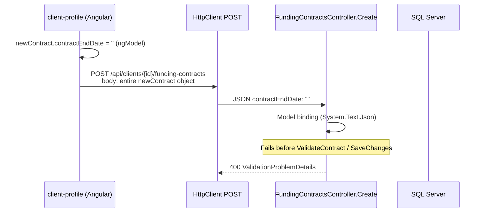

# Funding Contract End Date Investigation

**Date:** 2026-09-17  
**Scope:** Investigation only — no code, schema, validation, or data changes.  
**Demo blocker:** Alex Morgan funding contract — Start `2026-04-01`, End blank (open-ended).

---

## 1. Problem

During Phase 5 demo rehearsal, creating Alex Morgan’s funding contract fails at the API after submit. The **Funding contracts** form on the client profile allows **End** to be left blank (documented as optional / open-ended), but **Save contract** returns a validation-style HTTP 400. The intended contract is Anytown Council / General Care / nominal `4000`, start `2026-04-01`, **no end date**, followed by a weekly rate of **£575.00** from `2026-04-01` with no rate end date.

---

## 2. Reproduction

1. Log in as a tenant user with write access (e.g. TenantAdmin).
2. Open **Operations → Clients → Alex Morgan** (`/clients/{id}`).
3. Tab **Funding contracts**.
4. Set Authority, Category, Nominal, Start `2026-04-01`, leave **End** empty.
5. Click **Save contract**.

**Observed:** API error (user sees message via `getApiErrorMessage`, typically a generic “Unable to save contract.” or a problem-details title/errors payload).

**Expected (per `../demo/CLIENT_DEMO_OPERATOR_RUNBOOK.md`, `../demo/CLIENT_DEMO_EXECUTION_GUIDE.md`, `docs/BUSINESS_RULES.md`):** Contract saved as **Active** with open-ended end date; list shows **Open** in the End column.

**Note:** Live POST to Docker was not used during this investigation (investigation-only constraint). Root cause was confirmed with a local `System.Text.Json` probe using the same `CreateFundingContractRequest` DTO and `JsonSerializerDefaults.Web` as ASP.NET Core.

---

## 3. Current Data Flow



| Step | Component | Detail |
|------|-----------|--------|
| 1 | `client-profile.html` | `<input type="date" [(ngModel)]="newContract.contractEndDate" />` — no `required` |
| 2 | `client-profile.ts` | `newContract.contractEndDate` initialized to `''`; `saveContract()` posts `this.newContract` unchanged |
| 3 | HTTP | `POST /api/clients/{clientId}/funding-contracts` |
| 4 | DTO | `CreateFundingContractRequest.ContractEndDate` → `DateOnly?` |
| 5 | Controller | `ValidateContract` → overlap check → entity → `SaveChangesAsync` |
| 6 | Entity | `ClientFundingContract.ContractEndDate` → `DateOnly?` |
| 7 | EF / DB | Column `ClientFundingContracts.ContractEndDate` — SQL `date`, **nullable** |

**Contrast — rate history (same page):** `addRate()` sends `effectiveTo: this.newRate.effectiveTo || null`, so blank rate end is correctly represented as JSON `null`.

**Contrast — UAT scripts:** `scripts/uat-tc102-115.ps1` `New-Contract` only adds `contractEndDate` to the body when `$end` is not null (property **omitted** for open-ended).

---

## 4. Exact Root Cause

The Angular form posts **`contractEndDate` as an empty string `""`**, not `null` and not an omitted property.

ASP.NET Core model binding uses **System.Text.Json** with web defaults. Deserialization of `""` into `DateOnly?` **throws `JsonException`**:

```text
The JSON value could not be converted to System.Nullable`1[System.DateOnly]. Path: $.contractEndDate
```

Confirmed locally:

| Payload `contractEndDate` | Deserialization result |
|---------------------------|-------------------------|
| `""` (empty string) | **FAIL** — `JsonException` |
| omitted | **OK** — `ContractEndDate = null` |
| `null` | **OK** — `ContractEndDate = null` |

The request **never reaches** `FundingContractsController.ValidateContract` or persistence logic. This is **not** a business rule rejecting open-ended contracts.

**Exact JSON sent when End is blank (representative):**

```json
{
  "fundingAuthorityId": <selected id>,
  "invoiceCategoryId": <selected id>,
  "nominalCodeId": <selected id>,
  "contractStartDate": "2026-04-01",
  "contractEndDate": ""
}
```

`invoiceTemplateId` and `status` are not sent on create (API defaults status to `Active` on the entity).

---

## 5. Database Behaviour

| Item | Finding |
|------|---------|
| Migration | `20260829120000_AddOperationalDomain.cs`: `ContractEndDate = table.Column<DateOnly>(type: "date", nullable: true)` |
| Snapshot | `CareHomeDbContextModelSnapshot.cs`: `b.Property<DateOnly?>("ContractEndDate")` |
| EF mapping | `CareHomeDbContext.cs`: `ContractEndDate` → column type `date`, no `.IsRequired()` |
| NULL allowed? | **Yes** — open-ended contracts are stored as `NULL` |

Existing UAT remediation inserts open-ended rows with `ContractEndDate = NULL` (`scripts/uat-tc116-152.ps1`).

---

## 6. API Behaviour

| Layer | Open-ended end date supported? |
|-------|--------------------------------|
| `CreateFundingContractRequest.ContractEndDate` | **Yes** — `DateOnly?` |
| `ValidateContract` | Only rejects end **before** start; does **not** require end |
| `EnsureNoOverlappingContract` | Uses `FundingContractOverlap` / `DateRanges` with nullable end |
| FluentValidation / DataAnnotations on DTO | **None** on `ContractEndDate` |
| Controller create | Assigns `request.ContractEndDate` directly to entity |

**Intentional business rules (documented):** Null `ContractEndDate` means **open-ended** (`docs/BUSINESS_RULES.md`, `docs/UAT_REMEDIATION_REPORT.md`).

**Empty string:** Rejected at **JSON deserialization** (framework), not at custom validation.

---

## 7. Frontend Behaviour

| Item | Finding |
|------|---------|
| UI optional? | **Yes** — no validators on End date input |
| Display | Table shows `contract.contractEndDate || 'Open'` |
| Create payload | **Bug/mismatch** — sends `""` for blank End |
| Pattern elsewhere | `client-form.ts` coerces optional dates: `dischargeDate: ... \|\| null`; `addRate()` uses `effectiveTo \|\| null` |
| Typed model | `newContract` is untyped `any`-style inline object; no shared funding-contract model on create |

**Classification driver:** UI presents End as optional and matches product copy (“leave blank”), but the payload shape does not match what the API JSON binder accepts for `DateOnly?`.

---

## 8. Rate History Behaviour

| Step | Open-ended rate end (`EffectiveTo` null)? |
|------|-------------------------------------------|
| UI | Optional **To** field; display `effectiveTo \|\| 'Open'` |
| `addRate()` payload | `effectiveTo: this.newRate.effectiveTo \|\| null` → JSON **`null`** when blank |
| `CreateFundingRateRequest.EffectiveTo` | `DateOnly?` |
| Controller validation | Rejects `EffectiveTo < EffectiveFrom` only |
| Overlap check | `DateRanges.Overlaps` with nullable `EffectiveTo` |
| `ClosePreviousOpenEnded` | Closes prior open rate when adding a new rate with a later `EffectiveFrom` |
| DB | `FundingRates.EffectiveTo` — nullable `date` |

**Demo scenario (From `2026-04-01`, To blank, Weekly `575.00`):** The rate path is **already aligned** with open-ended semantics; no empty-string issue on create rate.

---

## 9. Billing Impact

Open-ended contract and rate periods are **first-class** in billing:

- `DateRanges.Intersect` / `Overlaps` treat `null` end as `DateOnly.MaxValue` (open-ended).
- Contract selection for a period: `DateRanges.Intersect(occupancy, contract start, contract end)` — null end includes all future dates in range.
- Rate selection: same for `EffectiveFrom` / `EffectiveTo`.
- Weekly amount: `RateCalculator` prorates `(rateAmount / 7) * inclusiveDays` over each intersected slice.

**August 2026 billing (Alex demo intent):**

- Contract start `2026-04-01`, `ContractEndDate` **null** → contract applies through August 2026 (subject to client occupancy / admission).
- Rate from `2026-04-01`, `EffectiveTo` **null** → rate applies through August 2026.
- No code path requires a non-null contract or rate end for invoice preview/generation.

**Fixing the UI payload to persist `NULL` does not require billing changes** and matches existing tests (`FundingContractOverlapTests` — adjacent closed vs open-ended; open-ended overlap rules).

**Risks if end were wrongly stored:** An invalid date from `""` binding failure prevents save entirely; there is no partial bad row from this specific bug.

---

## 10. Classification

| Category | Applies? | Why |
|----------|----------|-----|
| UI validation bug | Partial | UI does not block submit; optional field is correct |
| API validation bug | **No** | API does not require end date |
| **Frontend/backend contract mismatch** | **Yes (primary)** | UI sends `""`; API binder expects omitted/`null` for open-ended |
| Database constraint | **No** | Column is nullable |
| Intentional business rule | **No** | Domain explicitly allows null end |
| Unclear / product decision | **No** | Documented rule: null = open-ended |

**Overall:** **Frontend/backend contract mismatch** (with the same class of issue noted in `UI_API_FIELD_CONSISTENCY_AUDIT.md` P3 for empty strings vs null on optional fields). Functionally a **bug** relative to documented demo and business rules.

---

## 11. Smallest Safe Fix

**Do not change database or API validation rules.**

| Area | Change |
|------|--------|
| **Frontend file(s)** | `frontend/care-home-web/src/app/features/clients/pages/client-profile/client-profile.ts` — in `saveContract()`, build the POST body so blank end is **`null` or omitted** (mirror `addRate()` and `client-form.ts`). Example approach: `{ ...this.newContract, contractEndDate: this.newContract.contractEndDate \|\| null }` or destructure and omit when empty. |
| **Backend file(s)** | **None required** for the demo fix |
| **Validation rule** | None — binding already accepts `null`/omitted |
| **Database change** | **No** |
| **Migration** | **No** |
| **Existing data** | **Not affected** — fix is create-path payload only |
| **Billing logic** | **No changes** — already null-safe |

**Optional hardening (out of scope for smallest fix):** API JSON converter accepting `""` as null for all optional `DateOnly?` fields — broader blast radius; prefer UI normalization consistent with rates.

---

## 12. Regression Risks

Making **End** optional on the wire (null) is **already** the API/DB contract. Risks are low if only the frontend is fixed:

| Area | Impact of null open-ended end |
|------|-------------------------------|
| **Expired contracts** | No automatic expiry by date; `Status` remains Active/Inactive manually. End date only limits billing intersection. |
| **Contract overlap validation** | Unchanged; null end treated as open (`DateRanges.OpenEnded`). Two active open-ended streams on same authority+category still correctly rejected. |
| **Rate selection** | Unchanged; null `EffectiveTo` already supported. |
| **Billing** | **Positive** — enables intended demo path; aligns with `docs/BUSINESS_RULES.md`. |
| **Invoice generation** | Same as billing preview eligibility. |
| **Reporting** | No traced dependency on non-null `ContractEndDate` for core reports. |

**Regression to watch:** Ensure `contractStartDate` is still sent as `yyyy-MM-dd` when filled; only normalize **empty** end (not start).

---

## 13. Recommendation

1. **Fix the client profile create-contract payload** to send `contractEndDate: null` or omit the property when the date input is blank — same pattern as `addRate()` for `effectiveTo`.
2. **Do not** add API requirement for end date or change the database.
3. **Do not** change billing for this issue.
4. Optionally add an API integration test: POST create contract without `contractEndDate` → 201 and GET shows null end (UAT scripts already follow this pattern).

---

## 14. Required Tests After Fix

| # | Test |
|---|------|
| 1 | UI: Create contract with End blank → success; list shows **Open** for End. |
| 2 | API/DB: `ContractEndDate` IS NULL for that row. |
| 3 | UI: Add rate From `2026-04-01`, To blank, Weekly `575.00` → success. |
| 4 | Billing preview: company/care home, period including **August 2026**, client Alex → lines for General Care with weekly proration, no `MISSING_CONTRACT` / `MISSING_RATE`. |
| 5 | API: Create second open-ended contract on same authority+category → `400` `OVERLAPPING_FUNDING_CONTRACT` (overlap rules still work). |
| 6 | API: Create contract with explicit end before start → `400` “Contract end date cannot be before start date.” |
| 7 | Optional: POST with `contractEndDate: null` and omitted property both succeed (parity with UAT `New-Contract`). |

---

## Summary (executive)

| Question | Answer |
|----------|--------|
| Does the database allow NULL end? | **Yes** |
| Does EF entity allow nullable end? | **Yes** |
| Does request DTO allow null? | **Yes** |
| Does custom validation reject null end? | **No** |
| Does Angular allow empty End? | **Yes** |
| JSON when End blank? | **`"contractEndDate": ""`** |
| Backend and empty string? | **JsonException / 400** — not a valid `DateOnly?` |
| UI optional vs API? | **Mismatch on serialization**, not on business optional |
| Open-ended contracts elsewhere? | **Yes** — documented and used in overlap/billing tests |
| Billing supports null end? | **Yes** |
| Affect existing contracts if fixed? | **No** — only fixes new creates from UI |
